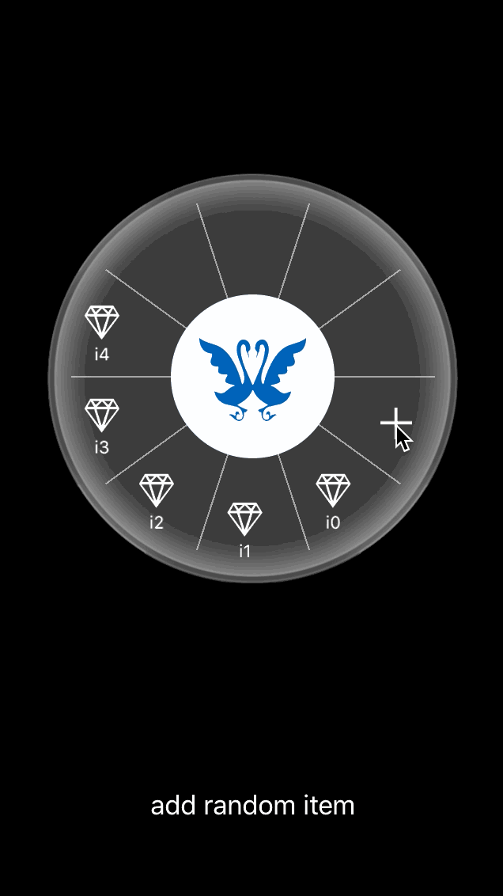

# CircleMenu

A circle menu (iOS version). You can customize the number of buttons with image and title between (1 ~ 9).

## Installation

1. Drag the `CircleMenu/LLCircleMenu` folder into your project.
2. Add `#include "LLCircleMenu.h"`, where you want to use it.

## Usage

### Initialization

    _circleMenuDemo = [[LLCircleMenu alloc] initWithFrame:CGRectMake(0, 0, 270, 270) andDelegate:self];
    _circleMenuDemo.center = CGPointMake(160, 240);
    [self.view addSubview:_circleMenuDemo];
    
### Customization

    int randomcount = arc4random() % 10;
    NSMutableArray *arrayItem = [[NSMutableArray alloc] init];
    for (int i = 0; i < randomcount; i++) {
      [arrayItem addObject:[[NSDictionary alloc] initWithObjectsAndKeys:[NSString stringWithFormat:@"i%d", i], @"title", @"item_bg.png", @"image", nil]];
    }
    [_circleMenuDemo setViewWithInfo:arrayItem];  

### Override the protocol
  
    - (void)circlemenu:(id)circlemenu didSelectRowAtIndex:(NSInteger)index;

## Licence

This code is distributed under the terms and conditions of [the MIT license](LICENSE.md).
